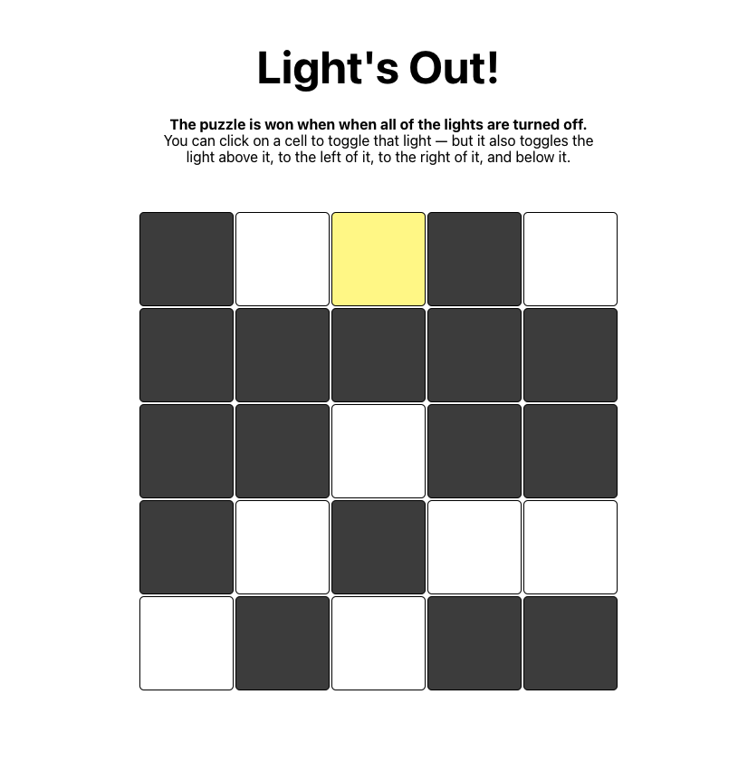

# Lights Out
This exercise provides a chance to work with React events where the state and events happen in different classes.



## The Game
Lights Out is a logic/puzzle game, played on a gird of individual lights, which can either be lit or unlit. The puzzle is won when when all of the lights are turned off.

You can click on a cell to toggle that light — but it also toggles the light above it, to the left of it, to the right of it, and below it. (Cells on an edge or in the corner won’t flip as many lights, since they are missing some neighbors).

## Plan
Before reading further, take a moment to think about how you would design this, component-wise.

We’ll give you a component design further down, but thinking about the requirements and what components/state/props would be needed will help you learn the skills to design applications out of components.


## Code
This game will be built from three components: 
- **App** : As often, this is a very simple component. It just renders the Board component.
- **Board** : The most sophisticated component. It will hold the state that represents the in-memory grid of true/false for lights-on/off. Since the state for the board lives here, this is also were the setState() calls will need to go — and therefore, the functions that call setState().
- **Cell** : A simpler component. This will simply render a ```<div>```, where the CSS classes will indicate whether this cell is lit or unlit. This is what the user clicks on — but it will need to call a function it receives from the Board, since that will need to update the state.


When the game is won, the board should not be shown, but a simple “You Won” message should show in its place.

A small amount of code is provided, but there are lots of places where you’ll need to write code to get the game functional.


## **How to Run**

```bash
$ git clone https://github.com/thedvo/react-lights-out-game.git
$ npm install
$ npm start
```